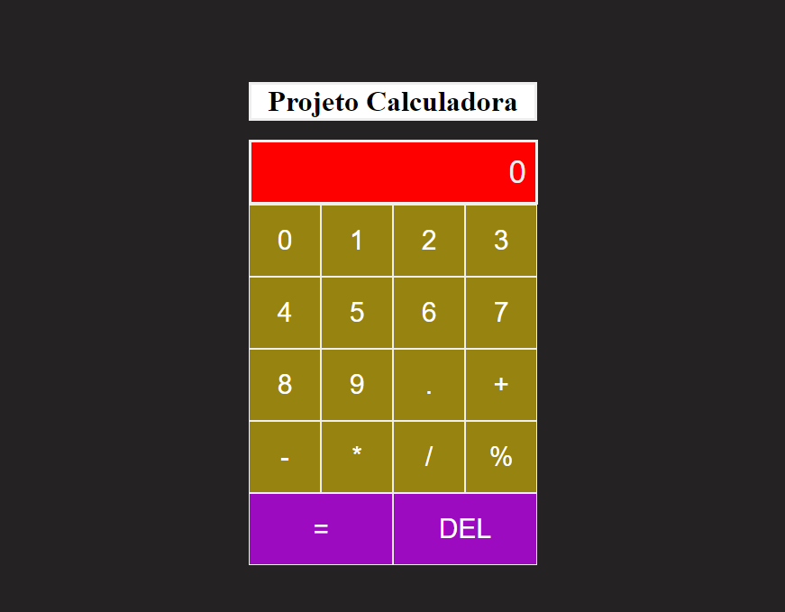

## Projeto calculadora com React.js 

##

    <h4>Este é um projeto simples de uma calculadora que desenvolvi utilizando o Framework React.js</h4>

##

    

##

Este projeto foi criado com a ferramenta Vite  integrada com o React.js 

